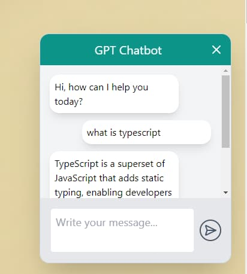

# Chatbot GPT

This a simple chatbot example using the GPT-4o-model model from OpenAI. The chatbot is divided into two parts: the frontend and the backend. The frontend is a simple Astro app that uses the backend to generate responses to user messages. The backend is a REST API that uses the GPT-40 mini model to generate responses to user messages.

The README is divided into two parts: the frontend and the backend. Each part has its own instructions on how to run the project.

## License

This project is licensed under the MIT License - see the [LICENSE](LICENSE) file for details.

## Screenshots

## TODO

- [ ] Add tests for the backend
- [ ] Add tests for the frontend
